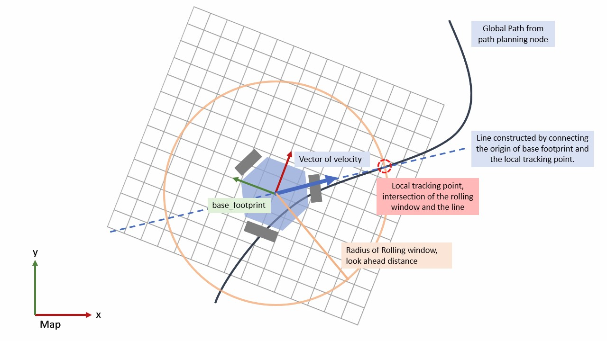
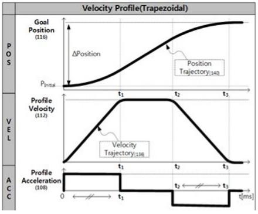

# Omni-drive Path Tracking Controller

此套全向底盤控制器是我基於 **Differential Drive Pure Pursuit Controller** 的概念作為發想，應用於全向移動底盤，
以下為我於動機系畢業專題的實做發式，若有錯誤之處可以提出一同討論。

* A* Global planner

    ```
    rosrun astar_nav astar.py
    ```

* Path Tracking Controller 
  * 路徑追蹤完成後，才追蹤機器人面向版本

    ```
    rosrun astar_nav omni_pathTracker.py
    ```

  * 同時追蹤機器人面向及路徑版本（邊走邊旋轉）

    ```
    rosrun astar_nav omni_pathTracker.py
    ```

---

## **基本概念**
### **主要運作流程**
* 獲取目標點座標、當前機器人座標，傳入 Global Planner service（當前使用A*），獲取全局路徑（**Global Path**）
  
* 以 **Rolling window method** 求得 `local goal`，作為當前追蹤目標
* 計算**速度向量長度**
* 計算**速度向量方向**
* 機器人到達目標點座標後，**追蹤角度**
* 完成追蹤此路徑

 ---

## **Concept of Rolling Window Method**



Fig 1. Concept of rolling window Method

### **參數設定**
  ```python
  # rolling window parameter
  self.d_lookahead = 0.2
  ```

### **運作方法**
1. 以機器人為圓心，**look ahead distance** 為半徑作圓
2. 求圓與路徑的交點為 **`local goal`**
3. 以 `local goal` 作為當前追蹤目標，**持續進行追蹤**，實現機器人追蹤路徑的目標
---
## **Tracking local goal**
追蹤 `local goal` 的部份，我將速度以向量形式表示，即同時代表**速度向量長度**以及**速度向量方向**
### **參數設定**
```python
# Linear Parameter
    self.max_linear_velocity = 0.5
    self.linear_acceleration = 0.3
    self.linear_brake_distance = 0.3
    self.k_p = 0.8

# Angular Parameter
    self.max_angular_velocity = 0.6
    self.angular_acceleration = 0.4
    self.angular_brake_distance = 0.35
    self.k_theta = 1
    self.theta_tolerance = 0.03
```

### **計算速度向量長度**
於 `self.velocity_profile()` 函式中實做
#### **加速速度規劃**
加速段的速度規劃以梯形曲線實現，根據給定加速度、最大速度進行實做



Fig 2. Velocity Profile

#### **減速速度規劃**
以 P control 的概念實現：
先根據當前位置及終點座標的距離計算出 error，輸出速度即為 P gain * error
   ```python
    ### linear
    if self.distance(curPos, goalPos) < brake_distance:
        output_vel = self.distance(curPos, goalPos) * self.k_p
    ### angular
    ### self.theta_convert converts theta domain to [-pi, pi]
    if self.theta_error(curPos.theta, goalPos.theta) < brake_distance:
        output_vel = self.k_theta * self.theta_convert(self.goalPos.theta - self.curPos.theta)
   ```
### **計算速度向量方向**
參考 Fig 1. 中所示：
1. 將 `local goal` 由 `map` 座標系轉換至 `base_footprint` 座標系
2. 在 `base_footprint` 座標系下，原點至 `local goal` 作一向量
3. 以此向量方向作為速度向量方向

### **追蹤完成**
當機器人位置進入到終點座標的容許範圍內時，判斷為 `xy_goalReached = 1`，停止追蹤路徑，開始追蹤終點座標角度
```python
self.xy_tolerance = 0.02
### when the self.distance(self.curPos, self.goalPos) < self.xy_tolerance, stop tracking path
```
---

## **Tracking robot Orientation**
和上述 **linear velocity** 所使用的速度規劃方式相同，以 P control 的方式進行角度追蹤，實做如下：
``` python
# ------Orientation tracking, while xy goal reached--------
while xy_goalreached and not self.theta_goalReached(self.curPos, self.goalPos) and not rospy.is_shutdown():
    angular_vel = self.velocity_profile("angular", self.curPos, self.goalPos, angular_vel, self.max_angular_velocity, rotate_direction * self.angular_acceleration, self.control_freqeuncy, self.angular_brake_distance)
    self.vel_publish(0,0,angular_vel)
    rate.sleep()
```
